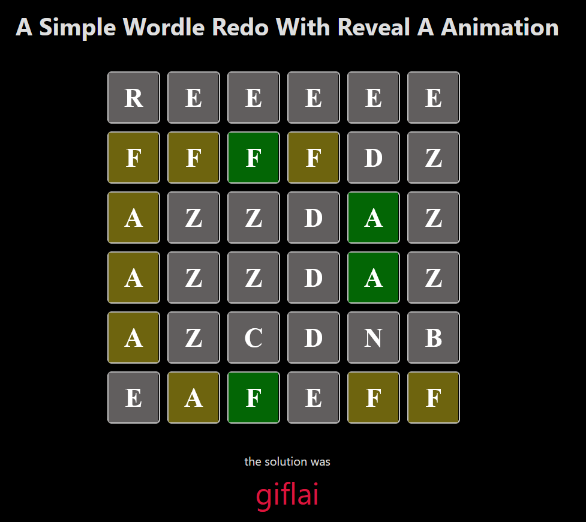

# Here are the note of theOneOps

I have dockerize the project, so to launch it just : 

execute this command:

```
docker-compose up
```
and to close the execution do :
```
Ctrl + C
```
then
```
docker-compose down
```

unless, you open another terminal and just execute : 
```
docker-compose down
```

What I have done on the project: 

- [X] Same features as the wordle game itself (with animation reveal and so on...)
- [X] Same logic of the wordle game
- [x] Addition of a server to get fetch from an API a word in french...
- [X] Words are from any length... between 5 and  

## Todo:
- [ ] Add security with some lazy loading in the game, only at the start
  
### Click on the picture to see a demo of the result on YTube

[](https://youtu.be/lljxZTJJwCo)